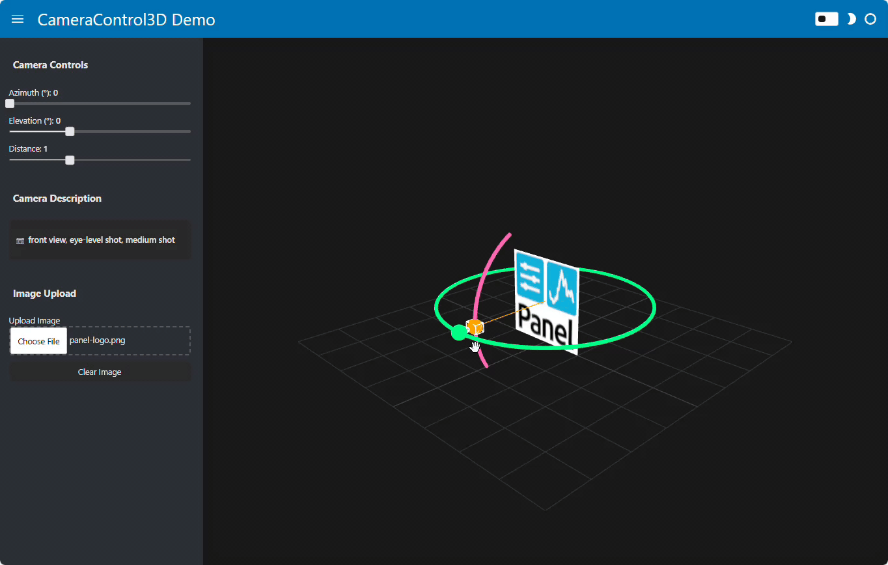
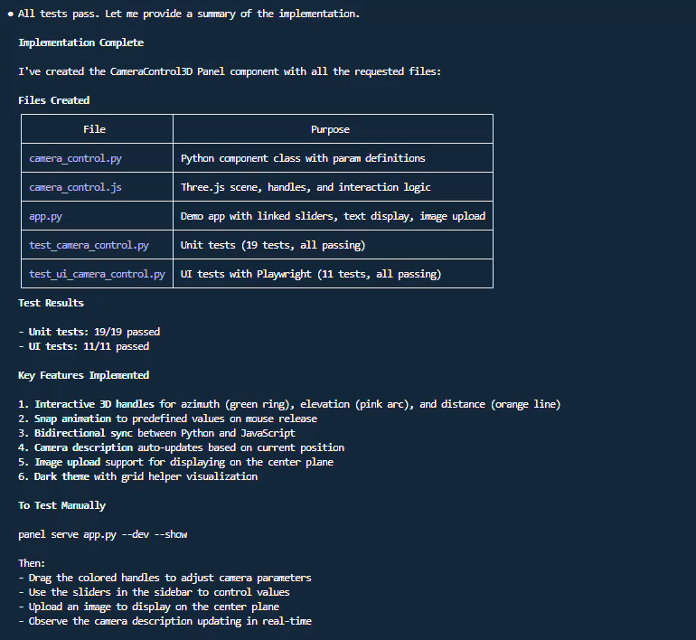

# Convert a Gradio 3D Camera Control Component

Convert a Gradio 3D camera control interface with Three.js, enabling users to visually manipulate azimuth, elevation, and distance parameters through draggable handles.


## Input

Ask Claude Code to convert the Gradio component:

```text
Please plan how to create a custom Panel component called CameraControl3D that provides an interactive 3D camera control interface using Three.js.

The component should display a 3D scene where users can manipulate camera parameters through visual handles:
- A green ring for azimuth (horizontal rotation, 0-360 degrees)
- A pink arc for elevation (vertical angle, -30 to 60 degrees)
- An orange line for distance (camera zoom, 0.6 to 1.8)

A Gradio example can be found in https://huggingface.co/spaces/multimodalart/qwen-image-multiple-angles-3d-camera/blob/main/app.py.

Please create camera_control.py and camera_control.js files.
Please create app.py with a demo that shows:
- The CameraControl3D component
- Linked sliders for each parameter (azimuth, elevation, distance)
- A text display showing the current camera description (e.g., "front view", "top-right view")
- An image upload option to display on the 3D plane

Output should also include passing tests in test_camera_control.py (pytest) and test_ui_camera_control.py (pytest-playwright).
```

When the plan is ready implement it.

!!! tip "Using the Panel Custom Components Skill"
    Claude Code has access to the HoloViz MCP server which includes a **panel-custom-components skill** with best practices for building custom components. The skill guides Claude on:

    - Using JSComponent for vanilla JavaScript wrapping
    - State synchronization with `model.on('param', callback)`
    - Syncing state from JS to Python via direct parameter assignment
    - Loading external libraries like Three.js via ESM imports
    - Handling user interactions and event propagation

## Result



With 19 passing unit tests and 11 passing UI tests.



<details><summary>camera_control.py</summary>

```python
"""CameraControl3D - A Panel component for interactive 3D camera control.

This module provides a custom Panel component using JSComponent that allows
users to manipulate camera parameters (azimuth, elevation, distance) through
visual handles in a Three.js scene.
"""

import param
from panel.custom import JSComponent
from pathlib import Path


# Mapping dictionaries for camera description generation
AZIMUTH_MAP = {
    0: "front view",
    45: "front-right quarter view",
    90: "right side view",
    135: "back-right quarter view",
    180: "back view",
    225: "back-left quarter view",
    270: "left side view",
    315: "front-left quarter view",
}

ELEVATION_MAP = {
    -30: "low-angle shot",
    0: "eye-level shot",
    30: "elevated shot",
    60: "high-angle shot",
}

DISTANCE_MAP = {
    0.6: "close-up",
    1.0: "medium shot",
    1.4: "wide shot",
    1.8: "very wide shot",
}


def _find_nearest(value, mapping):
    """Find the nearest key in a mapping to the given value."""
    keys = list(mapping.keys())
    nearest = min(keys, key=lambda k: abs(k - value))
    return mapping[nearest]


def generate_camera_description(azimuth, elevation, distance):
    """Generate a human-readable camera description from parameters."""
    azimuth_desc = _find_nearest(azimuth, AZIMUTH_MAP)
    elevation_desc = _find_nearest(elevation, ELEVATION_MAP)
    distance_desc = _find_nearest(distance, DISTANCE_MAP)
    return f"{azimuth_desc}, {elevation_desc}, {distance_desc}"


class CameraControl3D(JSComponent):
    """Interactive 3D camera control component using Three.js.

    This component provides a visual interface for manipulating camera parameters:
    - Azimuth: Horizontal rotation (0-360 degrees)
    - Elevation: Vertical angle (-30 to 60 degrees)
    - Distance: Camera zoom factor (0.6-1.8)

    Users can drag colored handles to adjust these parameters, which snap to
    predefined values on release. An optional image can be displayed on the
    center plane.
    """

    # Camera parameters (synced bidirectionally)
    azimuth = param.Number(
        default=0,
        bounds=(0, 360),
        doc="Horizontal rotation in degrees"
    )
    elevation = param.Number(
        default=0,
        bounds=(-30, 60),
        doc="Vertical angle in degrees"
    )
    distance = param.Number(
        default=1.0,
        bounds=(0.6, 1.8),
        doc="Camera zoom factor"
    )

    # Optional image to display on plane
    image_src = param.String(
        default="",
        doc="URL or data URL for image on plane"
    )

    # Camera description (Python -> JS only, computed)
    camera_description = param.String(
        default="front view, eye-level shot, medium shot",
        doc="Human-readable description of the camera position"
    )

    _importmap = {
        "imports": {
            "three": "https://esm.sh/three@0.160.0",
            "three/": "https://esm.sh/three@0.160.0/",
        }
    }

    _esm = Path(__file__).parent / "camera_control.js"

    def __init__(self, **params):
        super().__init__(**params)
        # Initialize the description based on default values
        self._sync_description()

    @param.depends("azimuth", "elevation", "distance", watch=True)
    def _sync_description(self):
        """Update the camera description based on current parameters."""
        self.camera_description = generate_camera_description(
            self.azimuth, self.elevation, self.distance
        )
```

</details>

<details><summary>camera_control.js</summary>

```javascript
import * as THREE from 'three';

// Snap values for camera parameters
const AZIMUTH_STEPS = [0, 45, 90, 135, 180, 225, 270, 315];
const ELEVATION_STEPS = [-30, 0, 30, 60];
const DISTANCE_STEPS = [0.6, 1.0, 1.4, 1.8];

// Colors for handles
const AZIMUTH_COLOR = 0x00ff88;    // Green
const ELEVATION_COLOR = 0xff69b4;  // Pink
const DISTANCE_COLOR = 0xffa500;   // Orange

// Center of the scene (where the subject would be)
const CENTER_Y = 0.5;

function findNearest(value, steps) {
    return steps.reduce((prev, curr) =>
        Math.abs(curr - value) < Math.abs(prev - value) ? curr : prev
    );
}

function degToRad(deg) {
    return deg * Math.PI / 180;
}

function radToDeg(rad) {
    return rad * 180 / Math.PI;
}

// Calculate camera position from spherical coordinates
function calculateCameraPosition(azimuth, elevation, distance) {
    const azRad = degToRad(azimuth);
    const elRad = degToRad(elevation);
    const camX = distance * Math.sin(azRad) * Math.cos(elRad);
    const camY = distance * Math.sin(elRad) + CENTER_Y;
    const camZ = distance * Math.cos(azRad) * Math.cos(elRad);
    return new THREE.Vector3(camX, camY, camZ);
}

export function render({ model, el }) {
    // Setup container
    el.style.width = '100%';
    el.style.height = '100%';
    el.style.minHeight = '400px';

    // Create scene
    const scene = new THREE.Scene();
    scene.background = new THREE.Color(0x1a1a1a);

    // Create viewing camera (fixed position)
    const viewCamera = new THREE.PerspectiveCamera(45, 1, 0.1, 100);
    viewCamera.position.set(4.5, 3, 4.5);
    viewCamera.lookAt(0, CENTER_Y, 0);

    // Create renderer
    const renderer = new THREE.WebGLRenderer({ antialias: true });
    renderer.setPixelRatio(window.devicePixelRatio);
    el.appendChild(renderer.domElement);

    // Add lighting
    const ambientLight = new THREE.AmbientLight(0xffffff, 0.6);
    scene.add(ambientLight);

    const directionalLight = new THREE.DirectionalLight(0xffffff, 0.8);
    directionalLight.position.set(5, 10, 5);
    scene.add(directionalLight);

    // Add grid helper
    const gridHelper = new THREE.GridHelper(4, 8, 0x444444, 0x333333);
    scene.add(gridHelper);

    // Create center plane for optional image
    const planeGeometry = new THREE.PlaneGeometry(1, 1);
    const planeMaterial = new THREE.MeshBasicMaterial({
        color: 0x666666,
        side: THREE.DoubleSide,
        transparent: true,
        opacity: 0.5
    });
    const centerPlane = new THREE.Mesh(planeGeometry, planeMaterial);
    centerPlane.position.set(0, CENTER_Y, 0);
    scene.add(centerPlane);

    // Texture loader for image
    const textureLoader = new THREE.TextureLoader();

    // Create azimuth ring (horizontal circle)
    const azimuthRingGeometry = new THREE.TorusGeometry(1.2, 0.02, 16, 64);
    const azimuthRingMaterial = new THREE.MeshBasicMaterial({ color: AZIMUTH_COLOR });
    const azimuthRing = new THREE.Mesh(azimuthRingGeometry, azimuthRingMaterial);
    azimuthRing.rotation.x = Math.PI / 2;
    azimuthRing.position.y = CENTER_Y;
    scene.add(azimuthRing);

    // Create azimuth handle (sphere on the ring)
    const azimuthHandleGeometry = new THREE.SphereGeometry(0.08, 16, 16);
    const azimuthHandleMaterial = new THREE.MeshBasicMaterial({ color: AZIMUTH_COLOR });
    const azimuthHandle = new THREE.Mesh(azimuthHandleGeometry, azimuthHandleMaterial);
    azimuthHandle.userData.type = 'azimuth';
    scene.add(azimuthHandle);

    // Create elevation arc (vertical arc)
    const elevationArcPoints = [];
    for (let i = -30; i <= 60; i += 5) {
        const rad = degToRad(i);
        const x = 1.0 * Math.cos(rad);
        const y = 1.0 * Math.sin(rad) + CENTER_Y;
        elevationArcPoints.push(new THREE.Vector3(0, y, x));
    }
    const elevationArcCurve = new THREE.CatmullRomCurve3(elevationArcPoints);
    const elevationArcGeometry = new THREE.TubeGeometry(elevationArcCurve, 32, 0.02, 8, false);
    const elevationArcMaterial = new THREE.MeshBasicMaterial({ color: ELEVATION_COLOR });
    const elevationArc = new THREE.Mesh(elevationArcGeometry, elevationArcMaterial);
    scene.add(elevationArc);

    // Create elevation handle
    const elevationHandleGeometry = new THREE.SphereGeometry(0.08, 16, 16);
    const elevationHandleMaterial = new THREE.MeshBasicMaterial({ color: ELEVATION_COLOR });
    const elevationHandle = new THREE.Mesh(elevationHandleGeometry, elevationHandleMaterial);
    elevationHandle.userData.type = 'elevation';
    scene.add(elevationHandle);

    // Create distance line
    const distanceLineMaterial = new THREE.LineBasicMaterial({ color: DISTANCE_COLOR });
    const distanceLineGeometry = new THREE.BufferGeometry();
    const distanceLine = new THREE.Line(distanceLineGeometry, distanceLineMaterial);
    scene.add(distanceLine);

    // Create distance handle
    const distanceHandleGeometry = new THREE.SphereGeometry(0.08, 16, 16);
    const distanceHandleMaterial = new THREE.MeshBasicMaterial({ color: DISTANCE_COLOR });
    const distanceHandle = new THREE.Mesh(distanceHandleGeometry, distanceHandleMaterial);
    distanceHandle.userData.type = 'distance';
    scene.add(distanceHandle);

    // Create camera model (wireframe frustum)
    const cameraModelGroup = new THREE.Group();

    // Camera body
    const cameraBodyGeometry = new THREE.BoxGeometry(0.15, 0.1, 0.1);
    const cameraBodyMaterial = new THREE.MeshBasicMaterial({
        color: 0xffffff,
        wireframe: true
    });
    const cameraBody = new THREE.Mesh(cameraBodyGeometry, cameraBodyMaterial);
    cameraModelGroup.add(cameraBody);

    // Camera lens (cone pointing toward center)
    const cameraLensGeometry = new THREE.ConeGeometry(0.05, 0.1, 8);
    const cameraLensMaterial = new THREE.MeshBasicMaterial({
        color: 0xffffff,
        wireframe: true
    });
    const cameraLens = new THREE.Mesh(cameraLensGeometry, cameraLensMaterial);
    cameraLens.rotation.x = Math.PI / 2;
    cameraLens.position.z = -0.1;
    cameraModelGroup.add(cameraLens);

    scene.add(cameraModelGroup);

    // State
    let isDragging = false;
    let activeHandle = null;
    let animating = false;

    // Raycaster for interaction
    const raycaster = new THREE.Raycaster();
    const mouse = new THREE.Vector2();

    // Update functions
    function updateHandlePositions() {
        const azimuth = model.azimuth;
        const elevation = model.elevation;
        const distance = model.distance;

        // Update azimuth handle position
        const azRad = degToRad(azimuth);
        azimuthHandle.position.set(
            1.2 * Math.sin(azRad),
            CENTER_Y,
            1.2 * Math.cos(azRad)
        );

        // Update elevation arc rotation (follows azimuth)
        elevationArc.rotation.y = azRad;

        // Update elevation handle position
        const elRad = degToRad(elevation);
        elevationHandle.position.set(
            1.0 * Math.cos(elRad) * Math.sin(azRad),
            1.0 * Math.sin(elRad) + CENTER_Y,
            1.0 * Math.cos(elRad) * Math.cos(azRad)
        );

        // Update distance line and handle
        const camPos = calculateCameraPosition(azimuth, elevation, distance);
        const centerPos = new THREE.Vector3(0, CENTER_Y, 0);

        distanceLineGeometry.setFromPoints([centerPos, camPos]);
        distanceHandle.position.copy(camPos);

        // Update camera model
        cameraModelGroup.position.copy(camPos);
        cameraModelGroup.lookAt(centerPos);
    }

    function updateImage() {
        const imageSrc = model.image_src;
        if (imageSrc) {
            textureLoader.load(imageSrc, (texture) => {
                planeMaterial.map = texture;
                planeMaterial.color.set(0xffffff);
                planeMaterial.opacity = 1.0;
                planeMaterial.needsUpdate = true;
            });
        } else {
            planeMaterial.map = null;
            planeMaterial.color.set(0x666666);
            planeMaterial.opacity = 0.5;
            planeMaterial.needsUpdate = true;
        }
    }

    function resize() {
        const width = el.clientWidth;
        const height = el.clientHeight;
        if (width === 0 || height === 0) return;

        viewCamera.aspect = width / height;
        viewCamera.updateProjectionMatrix();
        renderer.setSize(width, height);
    }

    // Animation for snapping
    function animateToSnap(param, targetValue, duration = 200) {
        if (animating) return;
        animating = true;

        const startValue = model[param];
        const startTime = performance.now();

        function animate(currentTime) {
            const elapsed = currentTime - startTime;
            const progress = Math.min(elapsed / duration, 1);

            // Ease out cubic
            const eased = 1 - Math.pow(1 - progress, 3);

            let newValue;
            if (param === 'azimuth') {
                // Handle wrap-around for azimuth
                let diff = targetValue - startValue;
                if (diff > 180) diff -= 360;
                if (diff < -180) diff += 360;
                newValue = startValue + diff * eased;
                if (newValue < 0) newValue += 360;
                if (newValue >= 360) newValue -= 360;
            } else {
                newValue = startValue + (targetValue - startValue) * eased;
            }

            model[param] = newValue;

            if (progress < 1) {
                requestAnimationFrame(animate);
            } else {
                model[param] = targetValue;
                animating = false;
            }
        }

        requestAnimationFrame(animate);
    }

    // Event handlers
    function getMousePosition(event) {
        const rect = renderer.domElement.getBoundingClientRect();
        mouse.x = ((event.clientX - rect.left) / rect.width) * 2 - 1;
        mouse.y = -((event.clientY - rect.top) / rect.height) * 2 + 1;
    }

    function onMouseDown(event) {
        event.preventDefault();
        getMousePosition(event);

        raycaster.setFromCamera(mouse, viewCamera);
        const intersects = raycaster.intersectObjects([azimuthHandle, elevationHandle, distanceHandle]);

        if (intersects.length > 0) {
            isDragging = true;
            activeHandle = intersects[0].object.userData.type;
            renderer.domElement.style.cursor = 'grabbing';
        }
    }

    function onMouseMove(event) {
        if (!isDragging || !activeHandle) return;

        event.preventDefault();
        getMousePosition(event);

        raycaster.setFromCamera(mouse, viewCamera);

        if (activeHandle === 'azimuth') {
            // Project onto horizontal plane at CENTER_Y
            const plane = new THREE.Plane(new THREE.Vector3(0, 1, 0), -CENTER_Y);
            const intersection = new THREE.Vector3();
            raycaster.ray.intersectPlane(plane, intersection);

            if (intersection) {
                let angle = Math.atan2(intersection.x, intersection.z);
                let degrees = radToDeg(angle);
                if (degrees < 0) degrees += 360;
                model.azimuth = degrees;
            }
        } else if (activeHandle === 'elevation') {
            // Project onto vertical plane aligned with current azimuth
            const azRad = degToRad(model.azimuth);
            const planeNormal = new THREE.Vector3(-Math.cos(azRad), 0, Math.sin(azRad));
            const plane = new THREE.Plane(planeNormal, 0);
            const intersection = new THREE.Vector3();
            raycaster.ray.intersectPlane(plane, intersection);

            if (intersection) {
                const dx = intersection.x * Math.sin(azRad) + intersection.z * Math.cos(azRad);
                const dy = intersection.y - CENTER_Y;
                let angle = Math.atan2(dy, dx);
                let degrees = radToDeg(angle);
                degrees = Math.max(-30, Math.min(60, degrees));
                model.elevation = degrees;
            }
        } else if (activeHandle === 'distance') {
            // Use vertical mouse movement for distance
            const plane = new THREE.Plane(new THREE.Vector3(0, 0, 1).applyAxisAngle(
                new THREE.Vector3(0, 1, 0), degToRad(model.azimuth)
            ), 0);
            const intersection = new THREE.Vector3();
            raycaster.ray.intersectPlane(plane, intersection);

            if (intersection) {
                const dist = intersection.length();
                model.distance = Math.max(0.6, Math.min(1.8, dist));
            }
        }
    }

    function onMouseUp(event) {
        if (isDragging && activeHandle) {
            // Snap to nearest step
            if (activeHandle === 'azimuth') {
                const snapped = findNearest(model.azimuth, AZIMUTH_STEPS);
                animateToSnap('azimuth', snapped);
            } else if (activeHandle === 'elevation') {
                const snapped = findNearest(model.elevation, ELEVATION_STEPS);
                animateToSnap('elevation', snapped);
            } else if (activeHandle === 'distance') {
                const snapped = findNearest(model.distance, DISTANCE_STEPS);
                animateToSnap('distance', snapped);
            }
        }

        isDragging = false;
        activeHandle = null;
        renderer.domElement.style.cursor = 'grab';
    }

    function onMouseEnter() {
        renderer.domElement.style.cursor = 'grab';
    }

    // Subscribe to model changes from Python
    model.on('azimuth', updateHandlePositions);
    model.on('elevation', updateHandlePositions);
    model.on('distance', updateHandlePositions);
    model.on('image_src', updateImage);

    // Handle resize
    model.on('resize', resize);

    // Add event listeners
    renderer.domElement.addEventListener('mousedown', onMouseDown);
    renderer.domElement.addEventListener('mousemove', onMouseMove);
    renderer.domElement.addEventListener('mouseup', onMouseUp);
    renderer.domElement.addEventListener('mouseleave', onMouseUp);
    renderer.domElement.addEventListener('mouseenter', onMouseEnter);

    // Animation loop
    function animate() {
        requestAnimationFrame(animate);
        renderer.render(scene, viewCamera);
    }

    // Initialize
    resize();
    updateHandlePositions();
    updateImage();
    animate();

    // Cleanup on remove
    model.on('remove', () => {
        renderer.domElement.removeEventListener('mousedown', onMouseDown);
        renderer.domElement.removeEventListener('mousemove', onMouseMove);
        renderer.domElement.removeEventListener('mouseup', onMouseUp);
        renderer.domElement.removeEventListener('mouseleave', onMouseUp);
        renderer.domElement.removeEventListener('mouseenter', onMouseEnter);
        renderer.dispose();
    });
}
```

</details>

<details><summary>app.py</summary>

```python
"""CameraControl3D Demo App.

A demonstration app showing the CameraControl3D component with linked sliders,
camera description display, and image upload functionality.

Run with: panel serve app.py --dev --show
"""

import base64

import panel as pn
import param

from camera_control import CameraControl3D

# Initialize Panel extension with throttled sliders for better performance
pn.extension(throttled=True)


class CameraControlDemo(pn.viewable.Viewer):
    """Demo application for the CameraControl3D component.

    Features:
    - Interactive 3D camera control with draggable handles
    - Linked sliders for azimuth, elevation, and distance
    - Real-time camera description updates
    - Image upload to display on the center plane
    """

    # Parameters matching the camera control
    azimuth = param.Number(
        default=0, bounds=(0, 360), doc="Horizontal rotation in degrees"
    )
    elevation = param.Number(
        default=0, bounds=(-30, 60), doc="Vertical angle in degrees"
    )
    distance = param.Number(
        default=1.0, bounds=(0.6, 1.8), step=0.1, doc="Camera zoom factor"
    )

    def __init__(self, **params):
        super().__init__(**params)

        with pn.config.set(sizing_mode="stretch_width"):
            # Create the 3D camera control component
            self._camera_control = CameraControl3D(
                azimuth=self.azimuth,
                elevation=self.elevation,
                distance=self.distance,
                sizing_mode="stretch_both",
            )

            # Link camera control parameters bidirectionally
            self._camera_control.link(
                self,
                azimuth="azimuth",
                elevation="elevation",
                distance="distance",
                bidirectional=True,
            )

            # Create sliders using from_param
            self._azimuth_slider = pn.widgets.FloatSlider.from_param(
                self.param.azimuth,
                name="Azimuth (°)",
                step=1,
            )
            self._elevation_slider = pn.widgets.FloatSlider.from_param(
                self.param.elevation,
                name="Elevation (°)",
                step=1,
            )
            self._distance_slider = pn.widgets.FloatSlider.from_param(
                self.param.distance,
                name="Distance",
                step=0.1,
            )

            # Create camera description display (reactive pane)
            self._description_pane = pn.pane.Markdown(
                self._camera_description,
                styles={
                    "font-size": "14px",
                    "padding": "10px",
                    "background": "#2a2a2a",
                    "border-radius": "5px",
                },
            )

            # Create file input for image upload
            self._file_input = pn.widgets.FileInput(
                accept=".png,.jpg,.jpeg,.gif,.webp",
                name="Upload Image",
            )

            # Clear image button
            self._clear_button = pn.widgets.Button(
                name="Clear Image",
                button_type="default",
            )
            self._clear_button.on_click(self._clear_image)

            # Watch for file uploads
            self._file_input.param.watch(self._on_file_upload, "value")

            # Build layout
            self._controls = pn.Column(
                "### Camera Controls",
                self._azimuth_slider,
                self._elevation_slider,
                self._distance_slider,
                pn.layout.Divider(),
                "### Camera Description",
                self._description_pane,
                pn.layout.Divider(),
                "### Image Upload",
                self._file_input,
                self._clear_button,
                max_width=350,
            )

            self._main_layout = pn.Row(
                self._camera_control,
                self._controls,
                sizing_mode="stretch_both",
            )

    @param.depends("azimuth", "elevation", "distance")
    def _camera_description(self):
        """Generate the camera description markdown."""
        return f"📷 **{self._camera_control.camera_description}**"

    def _on_file_upload(self, event):
        """Handle file upload and convert to data URL."""
        if event.new is not None:
            # Get the file data and convert to base64 data URL
            file_data = event.new
            mime_type = self._file_input.mime_type or "image/png"
            b64_data = base64.b64encode(file_data).decode("utf-8")
            data_url = f"data:{mime_type};base64,{b64_data}"
            self._camera_control.image_src = data_url

    def _clear_image(self, _event):
        """Clear the uploaded image."""
        self._camera_control.image_src = ""
        self._file_input.value = None

    def __panel__(self):
        """Return the main layout for notebook display."""
        return self._main_layout

    @classmethod
    def create_app(cls, **params):
        """Create a servable app with template."""
        instance = cls(**params)

        template = pn.template.FastListTemplate(
            title="CameraControl3D Demo",
            sidebar=[instance._controls],
            main=[instance._camera_control],
            main_layout=None,
            theme="dark",
        )
        return template


# Serve the app
if pn.state.served:
    CameraControlDemo.create_app().servable()
```

</details>
