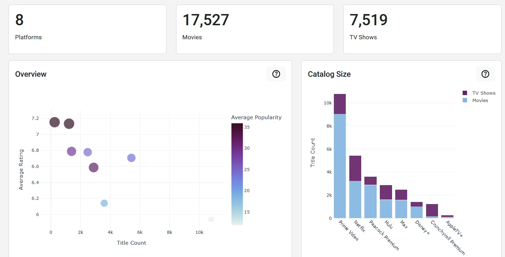

# Examples

Get inspired by what you can build with HoloViz MCP.

---

## Generate Dashboard from Picture

Upload a dashboard image and Claude recreates it.

[View Example →](generate-dashboard-from-picture.md)

---
