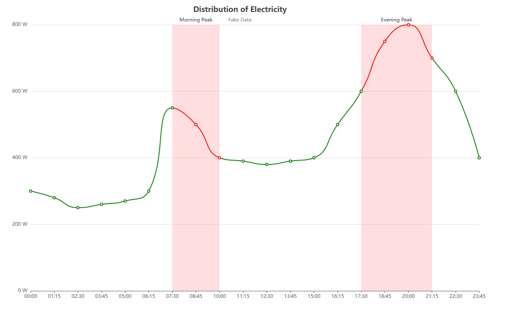
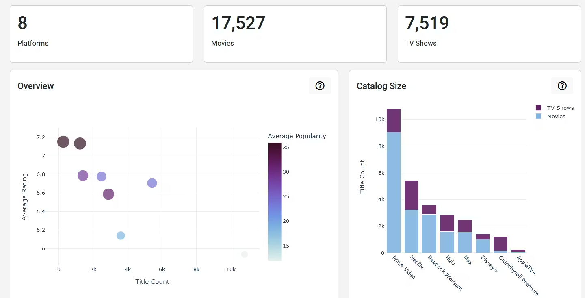
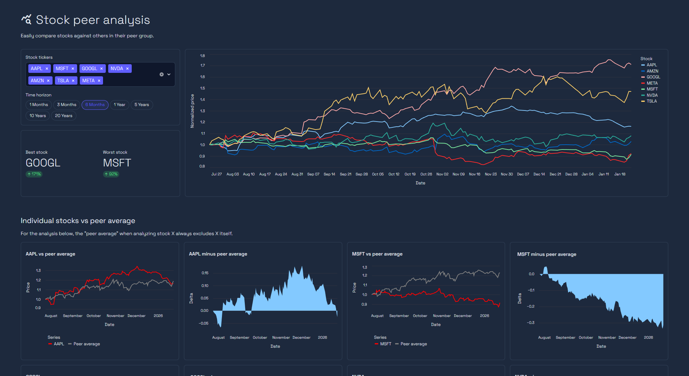
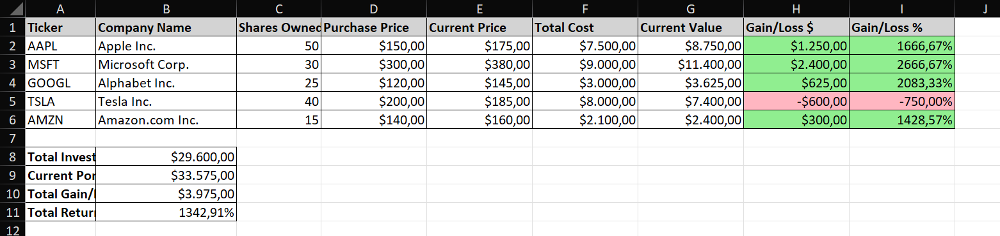
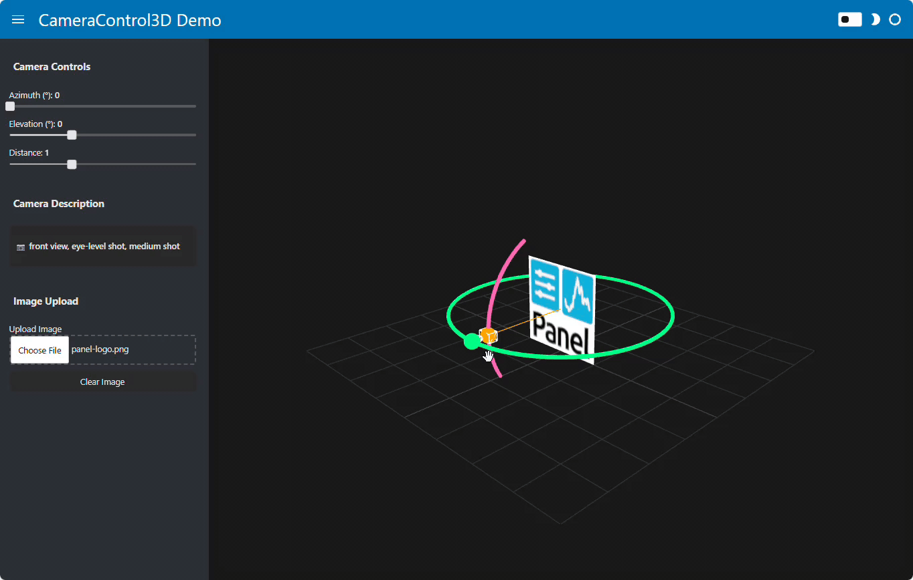
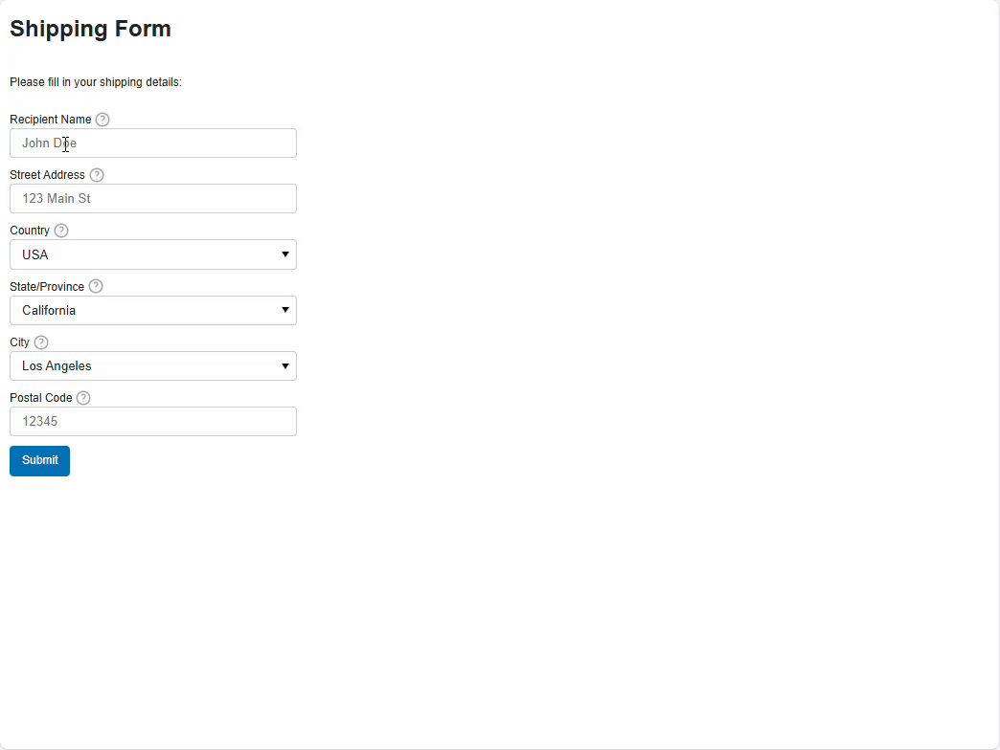
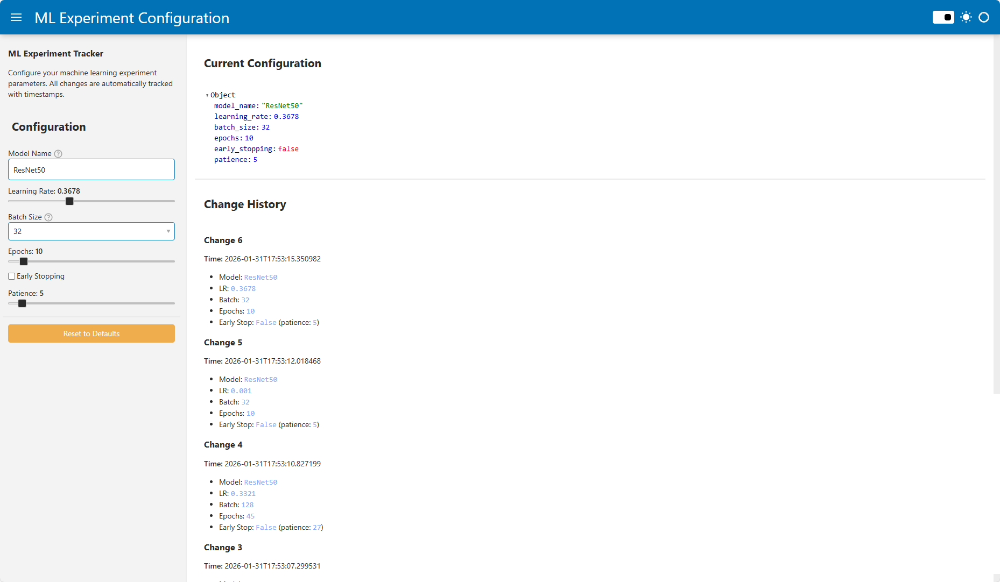

# Examples

Get inspired by what you can build with HoloViz MCP.

---

## Generate Plot from Picture

Upload a plot image and Claude recreates it with HoloViews.

[View Example →](generate-plot-from-picture.md)

---

## Generate Dashboard from Picture

Upload a dashboard image and Claude recreates it with Panel.

[View Example →](generate-dashboard-from-picture.md)

---

## Convert a Streamlit App

Upload a Streamlit app and ask Claude Code to recreate it using Panel!

[View Example →](convert-streamlit-app.md)

---

## Convert an Excel Spreadsheet

Upload an Excel spreadsheet and ask Claude Code to recreate it using Panel!

[View Example →](convert-excel-app.md)

---

## Convert a Gradio 3D Camera Control Component

Convert a Gradio 3D camera control interface with Three.js to a Panel component.

[View Example →](convert-gradio-component.md)

---

## Build a Shipping Form

Build a shipping address form with cascading country, state/province, and city selectors.

[View Example →](build-a-shipping-form.md)

---

## Build a Custom Model Viewer Component

Build a custom Panel component to wrap Google's `<model-viewer>` web component for interactive 3D model rendering.

[View Example →](build-custom-model-viewer.md)

---

## Create an ML Experiment Tracker

Build a machine learning experiment configuration tracker using Param's declarative parameter system.

[View Example →](create-ml-experiment-tracker.md)

---
