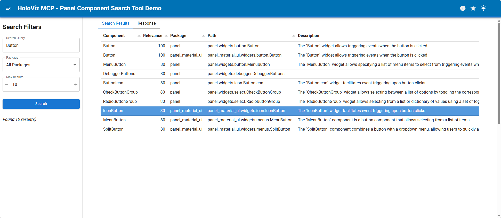

How‑To: Serve HoloViz MCP Panel apps locally for exploration, learning, and validation.

## Local Usage

### Prerequisites

- Install the project following the [Installation Guide](../how-to/installation.md).

### Steps

1. Start the local Panel server:
	```bash
	uvx holoviz-mcp-serve
	```
2. Open the URL printed in the terminal. This starts the bundled Panel apps.

## Online Demo

Try the hosted demo: [🤗 holoviz-mcp-ui](https://huggingface.co/spaces/awesome-panel/holoviz-mcp-ui)

[](https://awesome-panel-holoviz-mcp-ui.hf.space/configuration_viewer)
[](https://awesome-panel-holoviz-mcp-ui.hf.space/docs_get_best_practices)
[](https://awesome-panel-holoviz-mcp-ui.hf.space/docs_search)
[](https://awesome-panel-holoviz-mcp-ui.hf.space/panel_list_components)
[](https://awesome-panel-holoviz-mcp-ui.hf.space/panel_search_components)
